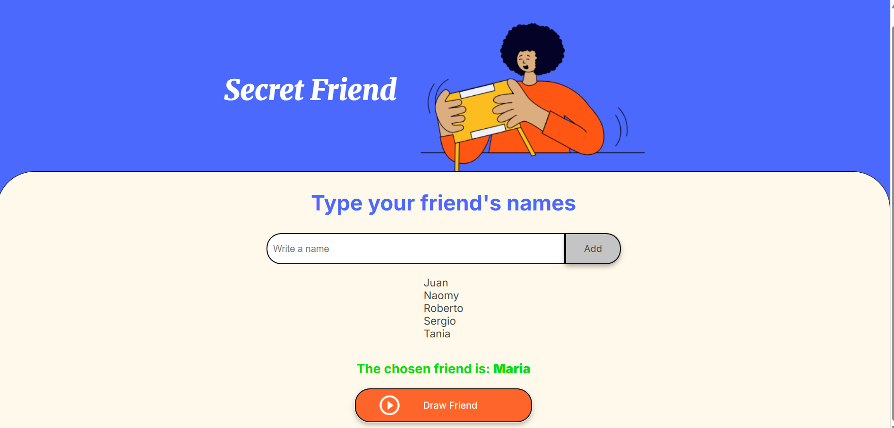

# Amigo Secreto

Una aplicación web simple para realizar un sorteo de "Amigo Secreto" de forma interactiva.

## Características

- Agrega nombres de amigos a una lista.
- Evita nombres duplicados.
- Realiza un sorteo aleatorio de un nombre por turno.
- Muestra el nombre sorteado y lo elimina del listado para no repetirlo.
- Interfaz amigable y en español.

## Vista previa



## Tecnologías usadas

- HTML5
- CSS3
- JavaScript
- Google Fonts

## Cómo usarlo

1. Clona el repositorio o descarga el ZIP:
   ```bash
   git clone https://github.com/JuanCG115/Amigo-secreto.git
